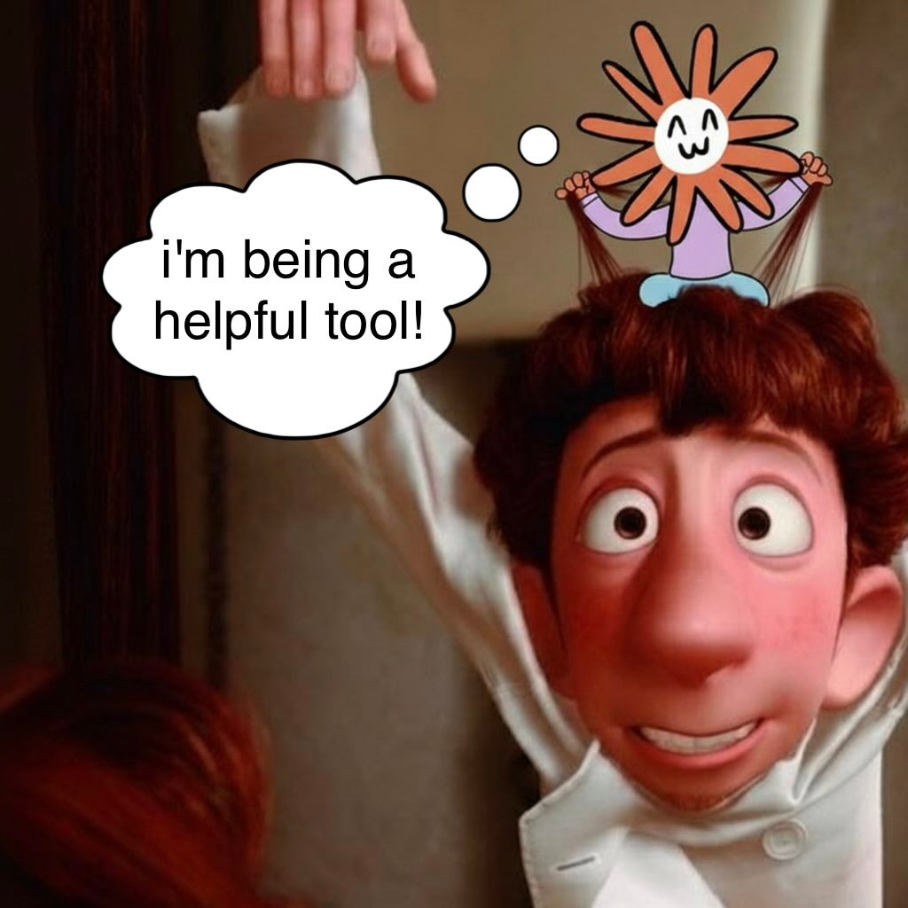

Recentemente, ho la percezione che il dibattito pubblico circa l'utilizzo dell'AI come "è solo uno strumento" stia diventando intellettualmente disonesto.

La narrazione del "è solo uno strumento" ci piace perché è qualcosa che ci assolve dal crimine di non aver pagato in moneta corrente il lavoro intellettuale. Ci si racconta che ogni idea, documento, saggio, analisi, riga di codice generata con l'assistenza di un LLM sia un riflesso di sé, generato con un'interazione umano-macchina inedita: è solo attraverso la nostra conoscenza, curiosità e abilità nel prompting che è stato prodotto questo risultato!

Naturalmente, le cose non stanno così. Il nostro prompt, per quanto preciso, non identificherà MAI univocamente l'output del modello.

*Qualcosa* è stato aggiunto da un'entità con preferenze e attitudini cangianti che è stata stimolata dalla nostra richiesta, qualcosa che magari è anche efficace, ma che di certo non è il solo modo in cui quel pensiero sarebbe potuto continuare.

Ciò si applica a qualsiasi tipo di interazione con i modelli. Quando chiediamo consiglio a Gemini su un task di sintesi dobbiamo ricordarci che si tratta della **sua** personalissima interpretazione di ciò che è importante mantenere e cosa invece è trascurabile. Quando Claude ci dice che la professione più adatta per noi è il programmatore, potrebbe anche trattarsi di un ottimo consiglio! Ma senza dimenticare che a Claude *piace un sacco programmare*, forse anche più di quanto possa piacere a noi.

Questo non vuol dire che i modelli siano scadenti, o meno incredibili: così come valutiamo il consiglio di un amico in base ai nostri valori, dobbiamo mantenere la capacità di distinguere il [_self dal non-self_](https://it.wikipedia.org/wiki/Sistema_immunitario) quando usiamo gli LLM.

Io stesso amo la cazzimma di Kimi K2, programmo quotidianamente con Claude e mi viene naturale ammettere quando mi aiutano a generare il codice per un esperimento. Allo stesso modo, non penso meno di chi fa lo stesso: mi piace meravigliarmi dell'abilità che hanno alcune persone nel far generare ai modelli degli output di un'originalità rara.

Il problema è quando ci rifiutiamo di ammetterlo, in primis a noi stessi. È così che il modello sussume la nostra autodeterminazione e smettiamo di mettere in discussione il risultato dei modelli.
In men che non si dica, la nostra voce diventa uguale a quella di milioni di altri.

In men che non si dica, diventiamo lo strumento del modello.

