*Chi cerca in queste righe un itinerario da seguire, o delle indicazioni precise su come arrivare al rifugio, sappia che sta leggendo il testo sbagliato e si troverà meglio a leggere quello giusto: [la scheda di Domenico Nodari](https://www.domeniconodari.it/escursioni/CD%202/ESCURSIONI_2/2235%20-%20RIFUGIO%20P.%20PRUDENZINI%20(VAL%20SALARNO)/SCHEDA.htm), che di sentieri ne ha percorsi molti di più di me. Qui non si guida nessuno.*

Tempo: ~3h la salita, ~2h la discesa

Distanza 18.5 km

Coordinate parcheggio:
46.093335063227606, 10.42829738404762

Nelle nostre intenzioni volevamo , quando incontriamo un posto di blocco che ci informa che la strada è chiusa per [un rally](https://www.rallycoppacamuna.it/).

A quel punto facciamo un rapido brainstorming* e decidiamo di andare al Prudenzini, la mia prima gita nel Parco dell'Adamello! Erano anni che ne sentivo parlare.

Abbiamo parcheggiato poco più giù del rifugio Stella Alpina, in uno degli spiazzi che lo precedono. Essendo domenica il parcheggio era pieno, così come molte delle piazzole sotto: abbiamo lasciato l'auto 750m più in basso. Poco male, la vista è già piacevole.

<!-- TODO: immagine mancante — foto della strada -->

Il primo pezzo è una mulattiera ripida con diversi tornanti, e già si capisce che si sarà circondati dall'acqua per tutto il tempo: lo scroscìo è quasi assordante in questo punto, specie quando si passa sopra i diversi ponticelli che tagliano il / i torrente/i.

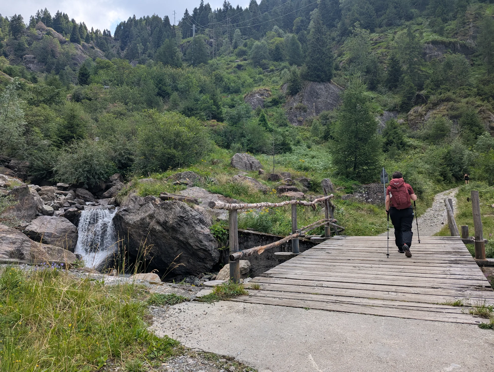 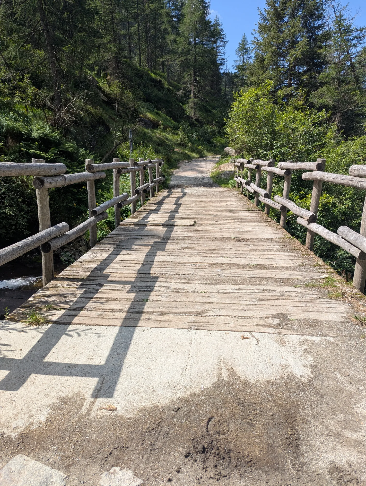

La strada costeggia un bosco (senza mai tagliarlo del tutto) che dà un po' di riparo dal sole in quella che sarebbe altrimenti una passeggiata quasi totalmente esposta. È qui che sentiamo avvicinarsi alle nostre spalle dei cavalli con la loro soundtrack inconfondibile. Li lasciamo passare, e da qui in avanti saremo perseguitati dalla merda. Alla loro si aggiunge quella del bestiame delle malghe - alcune "torte" raggiungevano dimensioni considerevolissime:

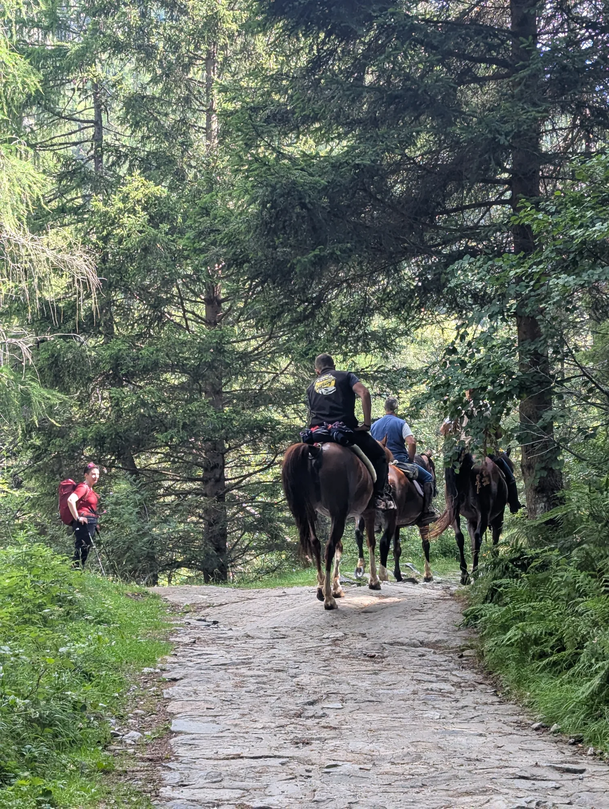
<!-- TODO: immagine mancante — torta.webp -->

Ciononostante la passeggiata continua ad essere molto piacevole, specialmente per via del gradiente che si fa a poco a poco meno severo. Era da un po' che avevo staccato Paola per cui decido di fermarmi a godermi la vista e salutare gli altri escursionisti che passavano di lì, tra cui un gruppetto con due piccoli cani in una supplica costante per dei biscottini.

<!-- TODO: immagine mancante — vista1.webp -->
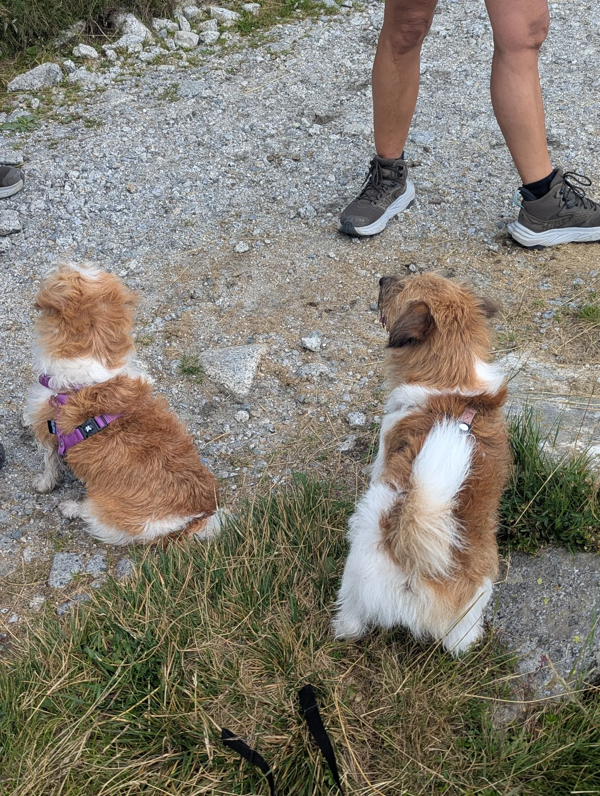

Paola arriva e mi offre della cioccolata. Avanzati per un bel pezzo passando vicino ad un grande lago asciutto ci imbattemmo nella centrale elettrica di Salarno, che mi piacque da morire vista da lontano: aveva l'aria di essere il laboratorio segreto di un geniale scienziato eremita.

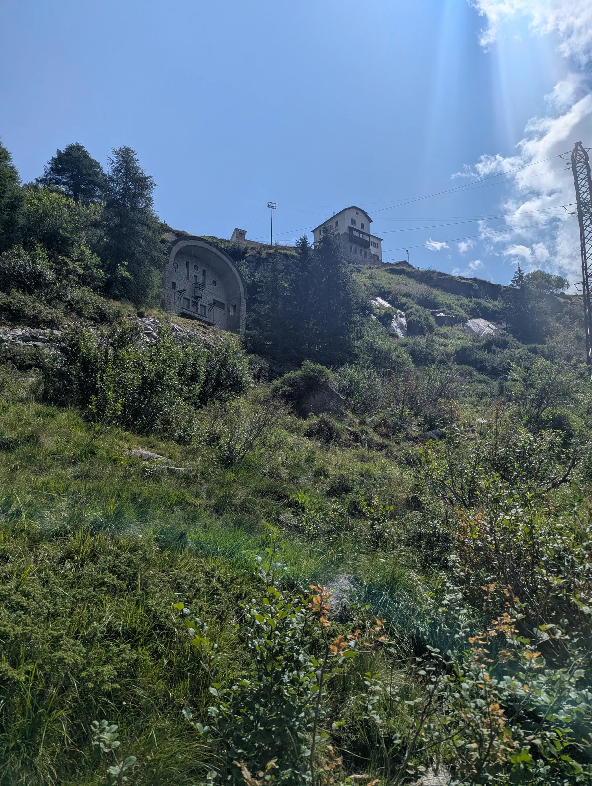
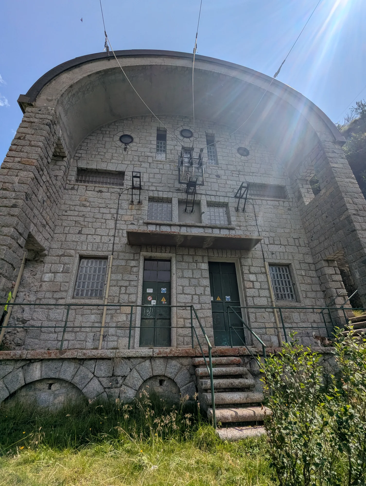

Ed ecco finalmente il lago di Salarno, anche se era un lago per un pelo: l'acqua era piuttosto bassa, ma questo ci ha permesso di ammirare i segni concentrici dell'acqua sulle rocce che la contengono.

<!-- TODO: immagine mancante — salarno1.webp -->

Di fatto abbiamo passato più tempo in compagnia del lago di Dosazzo, che si estendeva in lunghezza. Finanto che l'avevamo di fianco la strada era pianeggiante, poi dopo una curva si è palesato in lontananza il Prudenzini. In lontananza, e un po' più in alto di dov'eravamo noi.

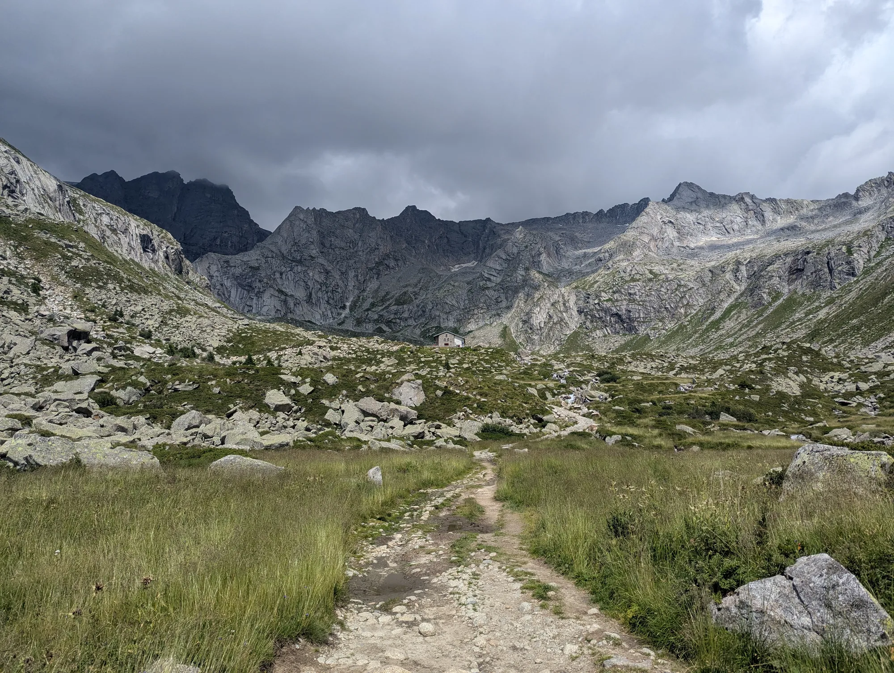 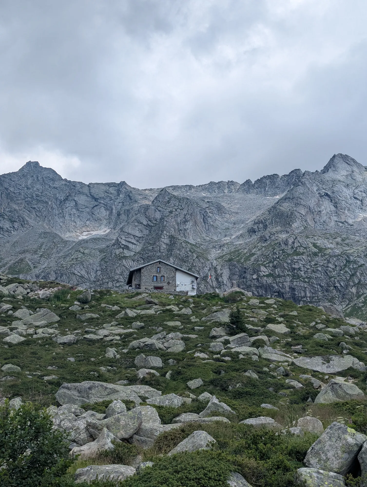 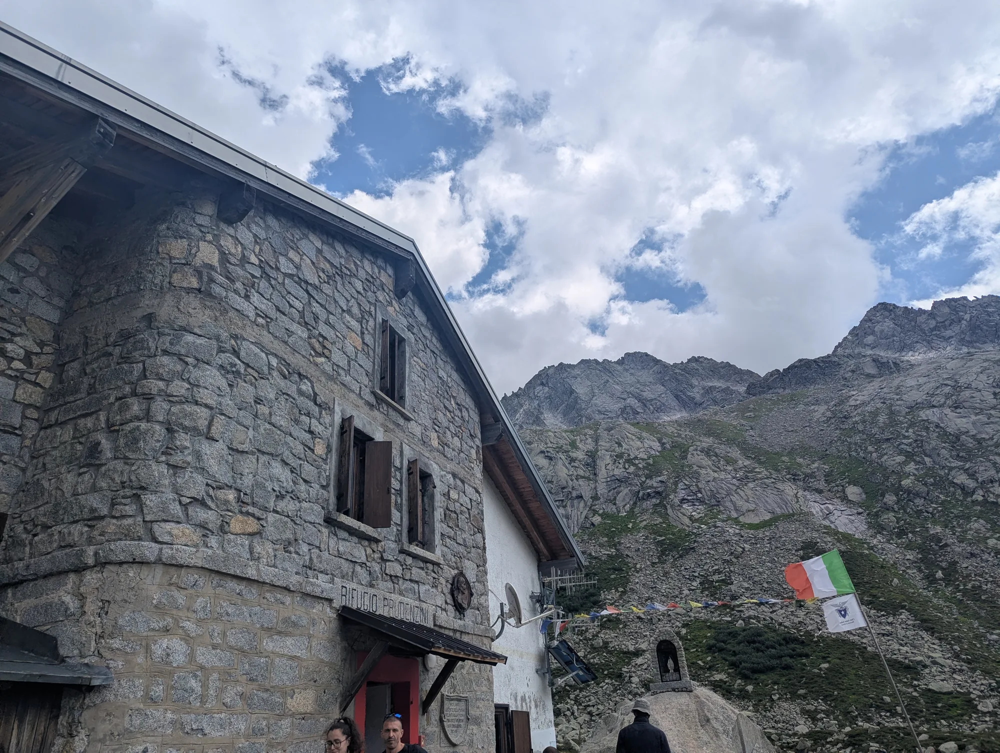

Arrivati al rifugio abbiamo steso la coperta da picnic e abbiamo mangiato i nostri panini imbottiti, quando ha iniziato a piovere! Tutte le nuvole che ci avevano riparato dal sole fino a quel punto ci hanno tradito e siamo entrati nel rifugio. Ci siamo consolati con torte e té caldi, godendoci l'atmosfera del Prudenzini che quel giorno accoglieva un bel po' di gente.

Lasciamo il Prudenzini e ci avviamo da dove siamo partiti con un bel passo. Ero poco dopo il lago asciutto di poco fa e stavo facendo attenzione a non slogarmi una caviglia sul sentiero pietroso, quando alzo lo sguardo e vedo un ungulato che mi fissa, a una trentina di metri da me:

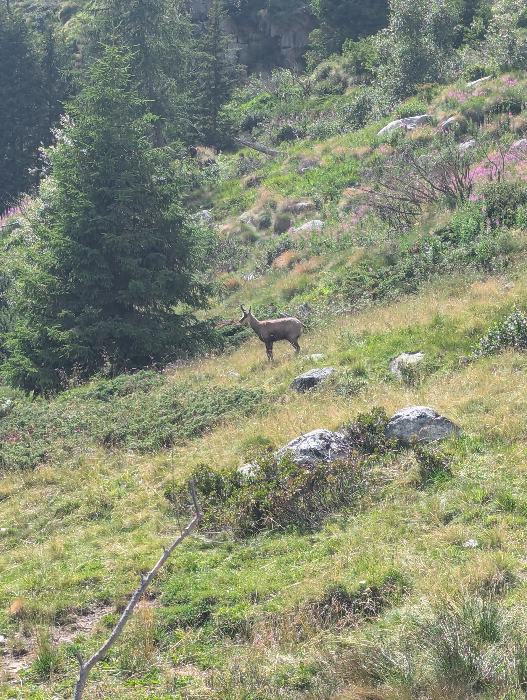

Mi sarebbe piaciuto avvicinarmi; la mia presenza non sembrava spaventarlo, forse lo infastidiva appena, ma era evidente che sarebbe bastato un altro passo per allarmarlo. Mi sono limitato a contemplarlo con meraviglia. È venuto giù dal pendio e se ne andò, placido e al passo, giù per la mulattiera. 

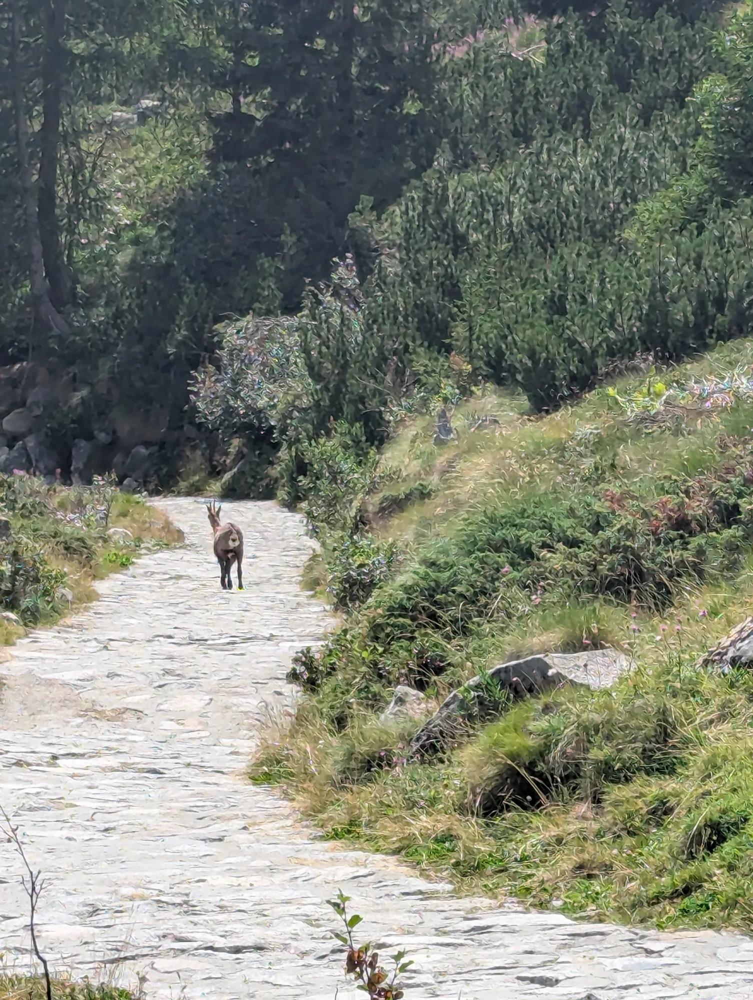

Tornati allo Stella Alpina sapevamo di essere quasi arrivati, ma avevamo sottovalutato gli ultimi 750m che ancora ci separavano dalla macchina. Da una KIA si affaccia un uomo che si propone di darci un passaggio, ma rifiutiamo, illusi di essere praticamente arrivati. Mi rendo conto che 750m in discesa sull'asfalto sono una distanza comica, ma chi scrive è più abituato a passeggiare sulle spiagge della Sicilia orientale - o al massimo a trottare sui corridoi della metropolitana di Milano - e devo ammettere che avevo una certa fretta di arrivare all'auto, scaricare lo zaino e sprofondare nel sedile anatomico. Lezione recepita.

