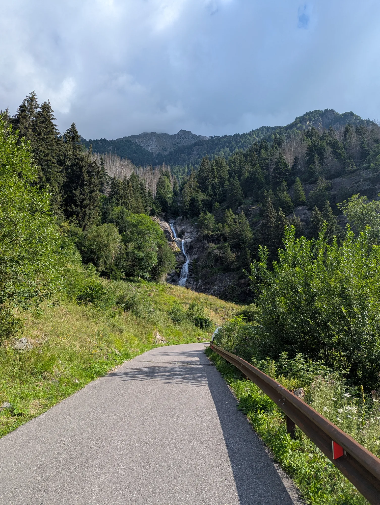
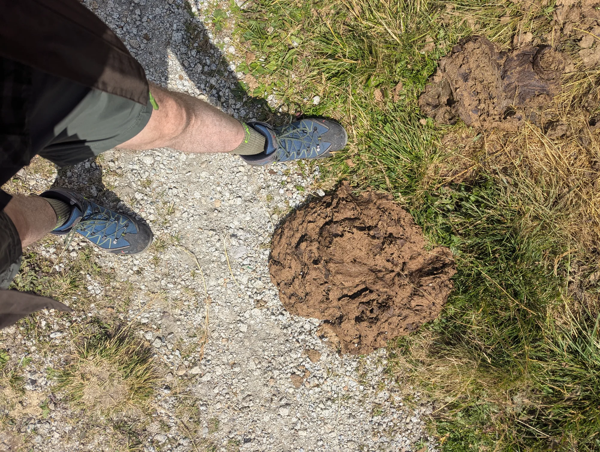
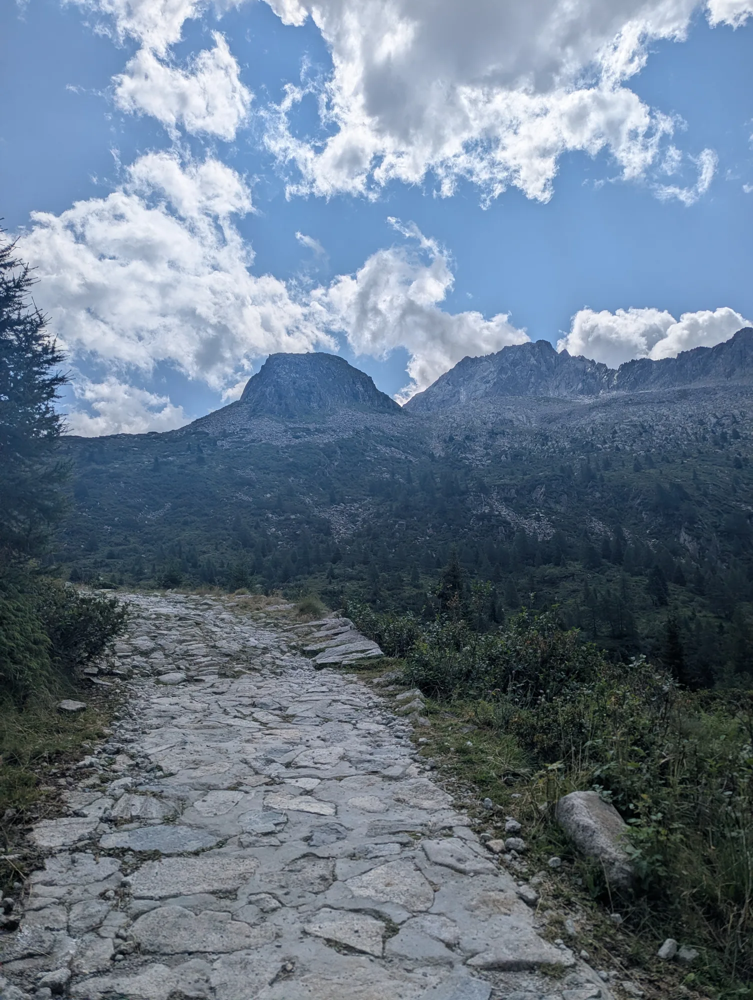
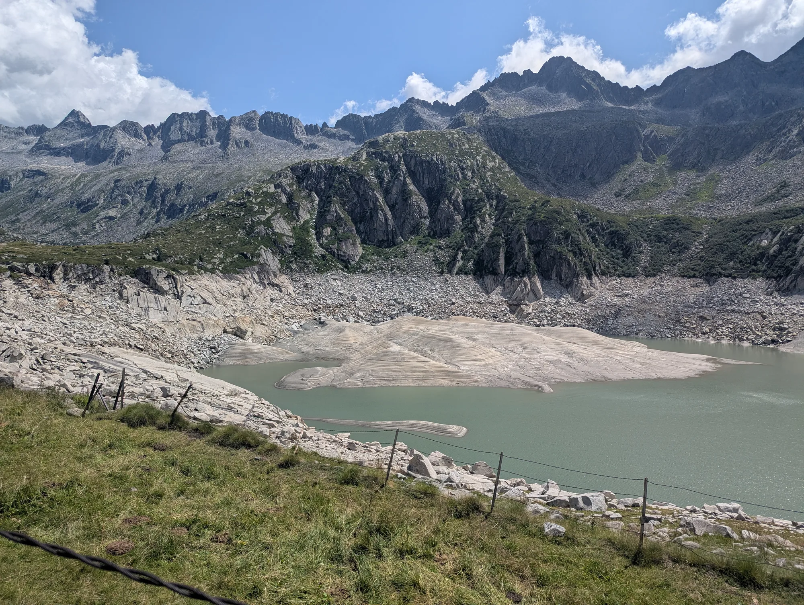

*Chi cerca in queste righe un itinerario da seguire, o delle indicazioni precise su come arrivare al rifugio, sappia che sta leggendo il testo sbagliato e si troverà meglio a leggere quello giusto: [la scheda di Domenico Nodari](https://www.domeniconodari.it/escursioni/CD%202/ESCURSIONI_2/2235%20-%20RIFUGIO%20P.%20PRUDENZINI%20(VAL%20SALARNO)/SCHEDA.htm), che di sentieri ne ha percorsi molti di più di me. Qui non si guida nessuno.*

Tempo: ~3h la salita, ~2h la discesa

Distanza 18.5 km

Coordinate parcheggio:
46.093335063227606, 10.42829738404762

Eravamo diretti al lago d'Arno, quando a Berzo Demo (nome incredibile per un paese) incontriamo un posto di blocco che ci informa che la strada è chiusa per [un rally](https://www.rallycoppacamuna.it/). Dopo un rapido brainstorming decidiamo di andare al Prudenzini, uno di quei posti che ho sentito nominare spesso ai miei amici della Valle.

Essendo domenica, il parcheggio era pieno, così come molte delle piazzole sotto. Abbiamo lasciato l'auto 750 m più in basso. Poco male: la vista era già una meraviglia.

Il primo pezzo è una mulattiera ripida con diversi tornanti, e già si capisce che si sarà circondati dall'acqua per tutto il tempo: lo scroscìo è assordante, specie quando si passa sopra i diversi ponticelli che scavalcano il torrente.





La strada costeggia un bosco (senza mai tagliarlo del tutto) che dà un po' di riparo dal sole in quella che sarebbe altrimenti una passeggiata quasi totalmente esposta. È qui che sentiamo avvicinarsi alle nostre spalle dei cavalli con la loro soundtrack inconfondibile. Li lasciamo passare, e da qui in avanti saremo perseguitati dalla merda. Alla loro si aggiunge quella del bestiame delle malghe — alcune "torte" raggiungeranno dimensioni considerevolissime:





Ciononostante la passeggiata continua ad essere molto piacevole, specialmente per via del gradiente che si fa a poco a poco meno severo. Era da un po' che avevo staccato Paola per cui decido di fermarmi a godere della vista e a salutare gli altri escursionisti che passavano di lì, tra cui un gruppetto con due piccoli cani in una supplica costante per dei biscottini.





Paola mi raggiunge e mi offre due quadratini del suo Ritter Sport Fondente Mandorle Intere. Avanzati per un bel pezzo passando vicino ad un grande lago asciutto ci siamo imbattuti nella centrale elettrica di Salarno, che mi è piaciuta da morire vista da lontano: aveva l'aria di essere il laboratorio segreto di un geniale scienziato eremita.





Ed ecco finalmente il lago di Salarno, anche se era un lago per un pelo: l'acqua era piuttosto bassa, ma questo ci ha permesso di ammirare i segni concentrici dell'acqua sulle rocce che la contengono.

Di fatto abbiamo passato più tempo in compagnia del lago di Dosazzo, che si estende in lunghezza fiancheggiando il sentiero. Finché era al nostro fianco la strada era pianeggiante, poi dopo una curva si è palesato in lontananza il Prudenzini, un po' più in alto di dove ci trovavamo.

Arrivati al rifugio abbiamo steso la coperta da picnic e spacchettati i nostri panini imbottiti, quando ha iniziato a piovigginare all'inizio quasi per scherzo e poi più seriamente. Abbiamo ritrovato lo spirito consolati dalle torte e dai té caldi, godendoci l'atmosfera dentro il Prudenzini che quel giorno accoglieva un buon numero di escursionisti.

Lasciato il Prudenzini abbiamo ripercorso al contrario la strada da dove eravamo venuti con un bel passo. Mi trovavo poco dopo il lago asciutto di poco prima e stavo facendo attenzione a non slogarmi una caviglia sul sentiero pietroso, quando alzo lo sguardo e vedo quest'ungulato che mi fissa, a una trentina di metri da me:

Mi sarebbe piaciuto avvicinarmi; la mia presenza non sembrava spaventarlo, forse lo infastidiva appena, ma era evidente che sarebbe bastato un altro passo per allarmarlo. Mi sono limitato a contemplarlo con meraviglia. È venuto giù dal pendio e se n'è andato, placido e al passo, giù per la mulattiera. Quasi ci rimango male, poi penso che sarebbe stato inverosimile se mi fosse venuto incontro a salutarmi come un fratello che non vedeva da anni.

Tornati allo Stella Alpina sapevamo di essere quasi arrivati, ma avevamo sottovalutato gli ultimi 750m che ancora ci separavano dalla macchina. Da una KIA si affaccia un uomo che si propone di darci un passaggio, ma rifiutiamo, illusi di essere praticamente arrivati. Mi rendo conto, adesso, che 750m in discesa sull'asfalto sono una distanza comica, ma chi scrive è più abituato a passeggiare a 0.1m s.l.m. sulle spiagge della Sicilia orientale — o al massimo a trottare nei corridoi della metropolitana — e devo ammettere che avevo una certa fretta di arrivare all'auto, scaricare lo zaino e sprofondare nel sedile anatomico. Che mi sia da lezione.

