# Solo amore per la Yashica Funtastic Keychain Camera

Di recente ho acquistato per me e Paola due minifotocamere Yashica Funtastic, e me ne sono totalmente innamorato.


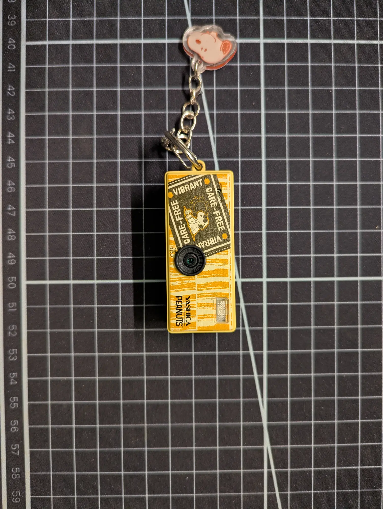
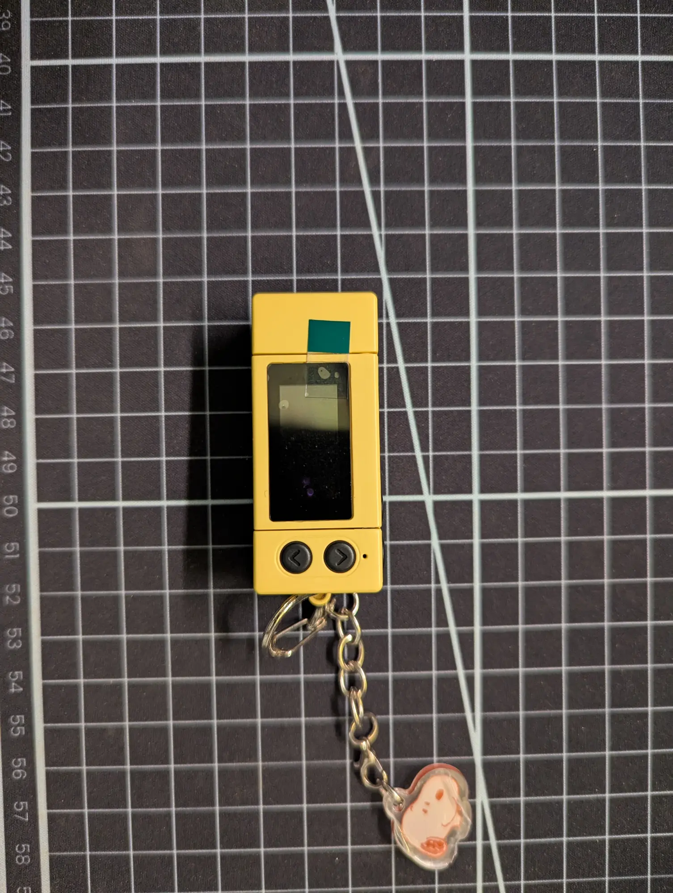
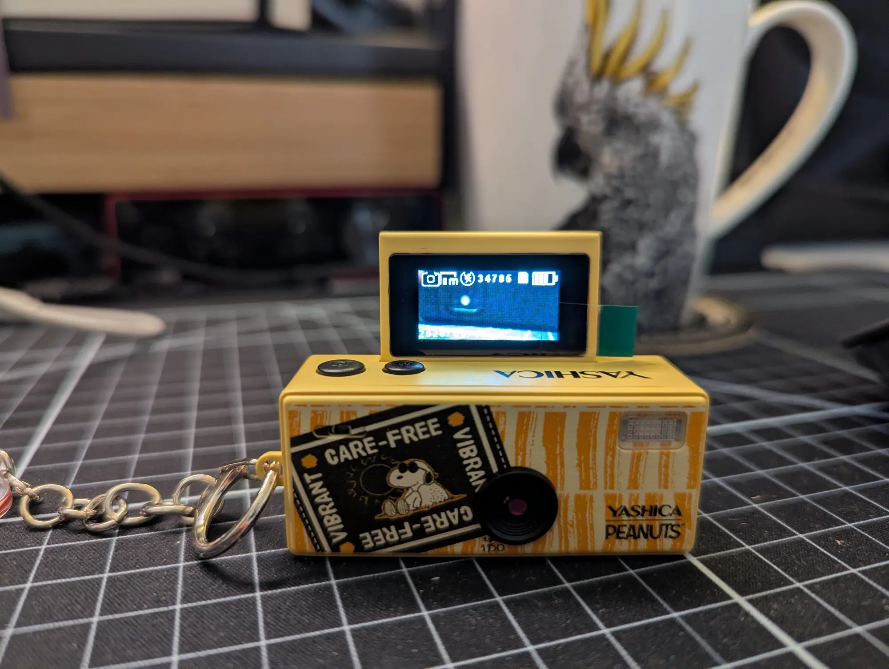


Le specifiche non hanno importanza, se non che ogni foto è 1280x960 pixel e cuba poche centinaia di kilobyte. Le fotocamere sono arrivate sprovviste di scheda SD: speravo di poter riciclare qualche vecchia scheda dal cimitero dei progetti e delle passioni lasciate a metà, ma stranamente erano ancora tutte impegnate: chi contiene ROM (e preziosissimi salvataggi) di una flashcard di un Nintendo DS, chi fa da disco al RPi 3b, non ne potevo demansionarne nessuna.

Riesco a trovare una scheda SD di penultima scelta che mi può essere consegnata in tempi brevi della capienza di 8GB. Prima di acquistarla non ho pensato fosse necessario calcolare quante foto potessero starci in 8GB, ma ci ha pensato la fantastica Funtastic a dirmelo al primo avvio:

34.934.

Provo a dare un senso a quel numero: fanno quasi dieci foto al giorno, tutti i giorni per dieci anni, no? Wow, incredibile, davvero una fraccata, che bello.

Per il resto della serata continuo a pensare a questo fatto, e di quanto mi piace scorrere la galleria del telefono puntandola in punto a caso della mia vita, provare nostalgia o magari sollievo per un passato che esiste solo come passato. Oppure: la soddisfazione di tenere i ricordi più importanti bene in vista e, quando la foto non si trova perché non esiste, il rammarico di dovermi accontentare della mia memoria che col tempo non può che rovinarsi.

E se provassi davvero a scattare dieci foto al giorno? Questa realizzazione, unito al fatto che la Funtastic è un oggetto adorabile, mi ha fatto venir voglia di documentare (quasi) tutte le mie giornate. Mi prometto di provarci.


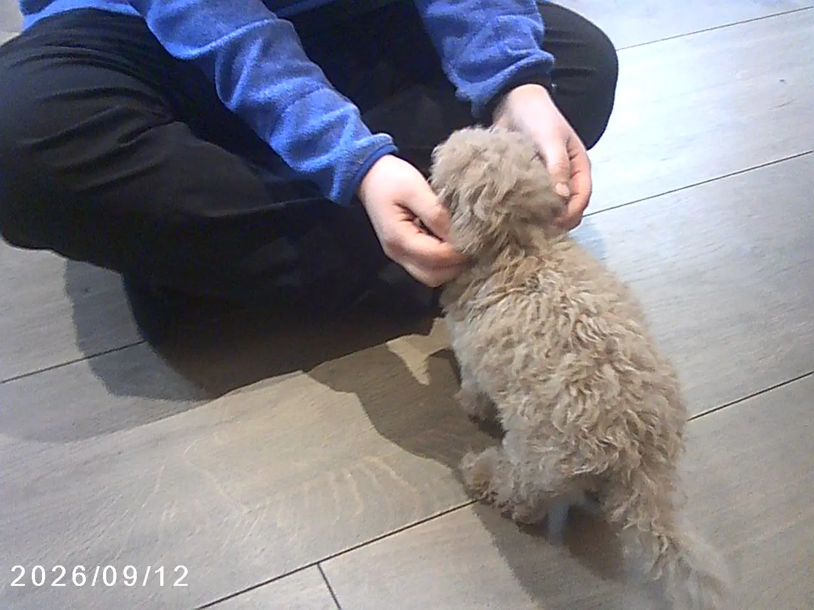

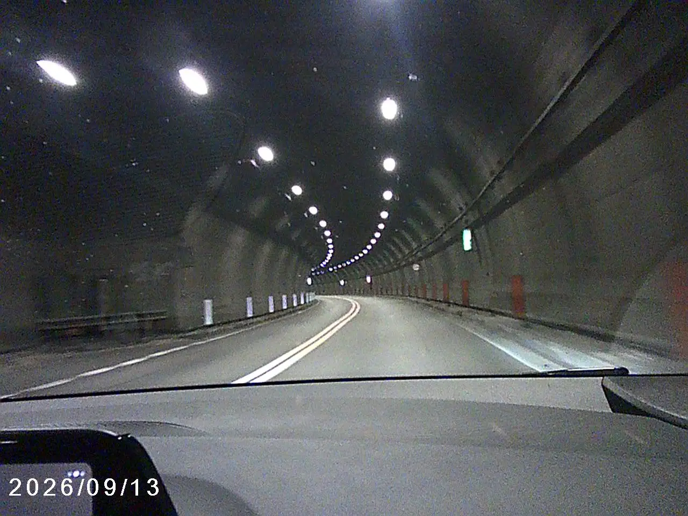
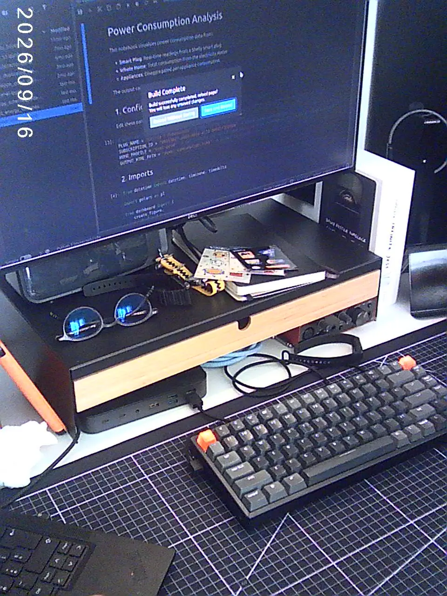
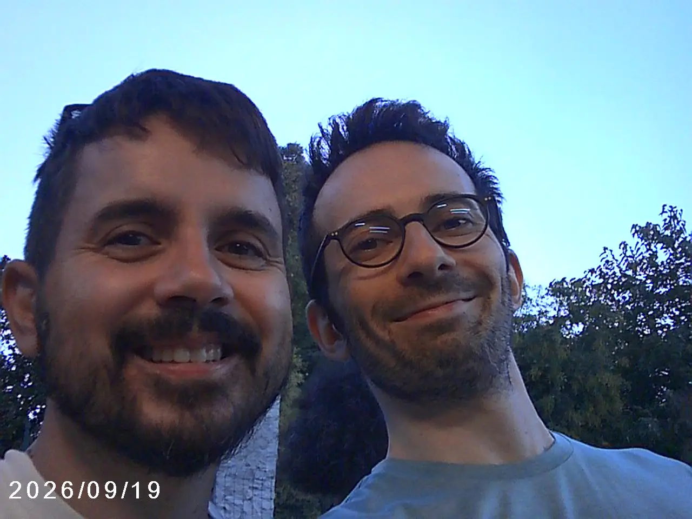
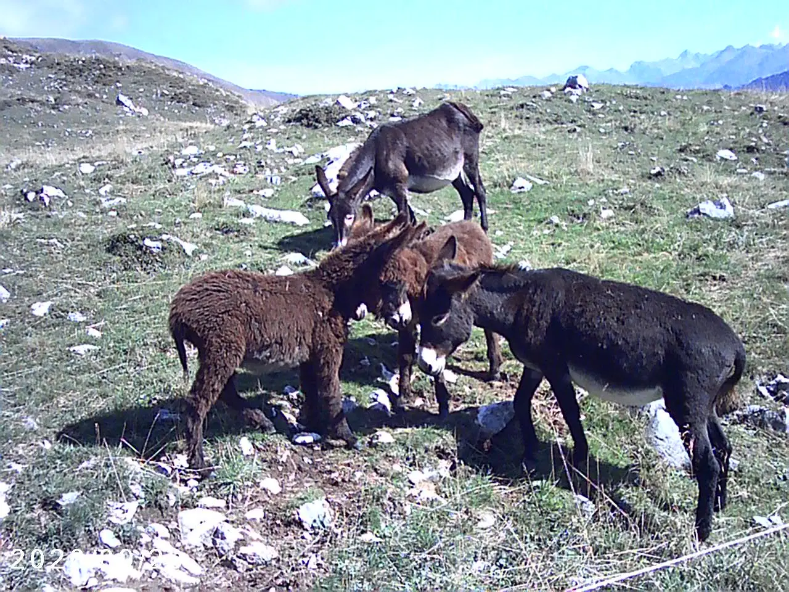
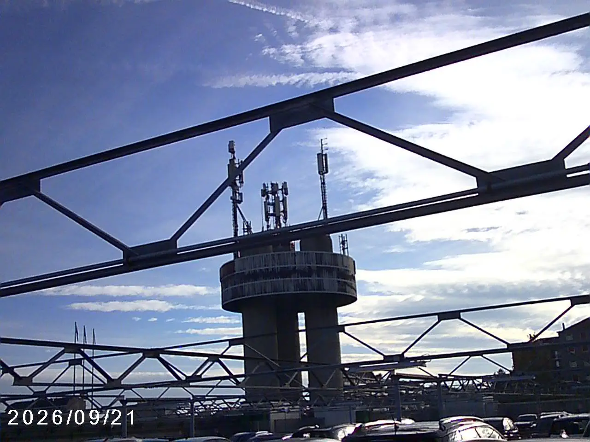
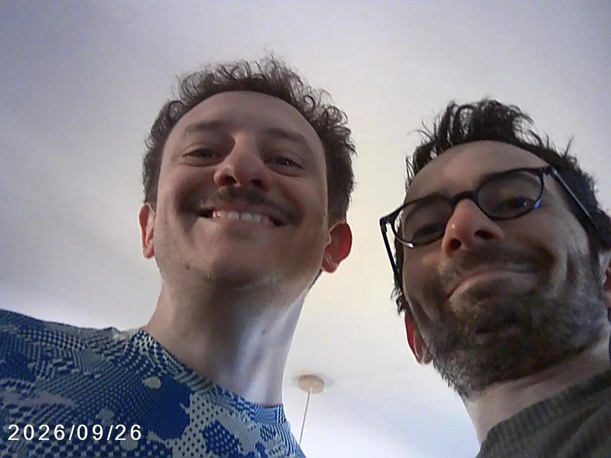
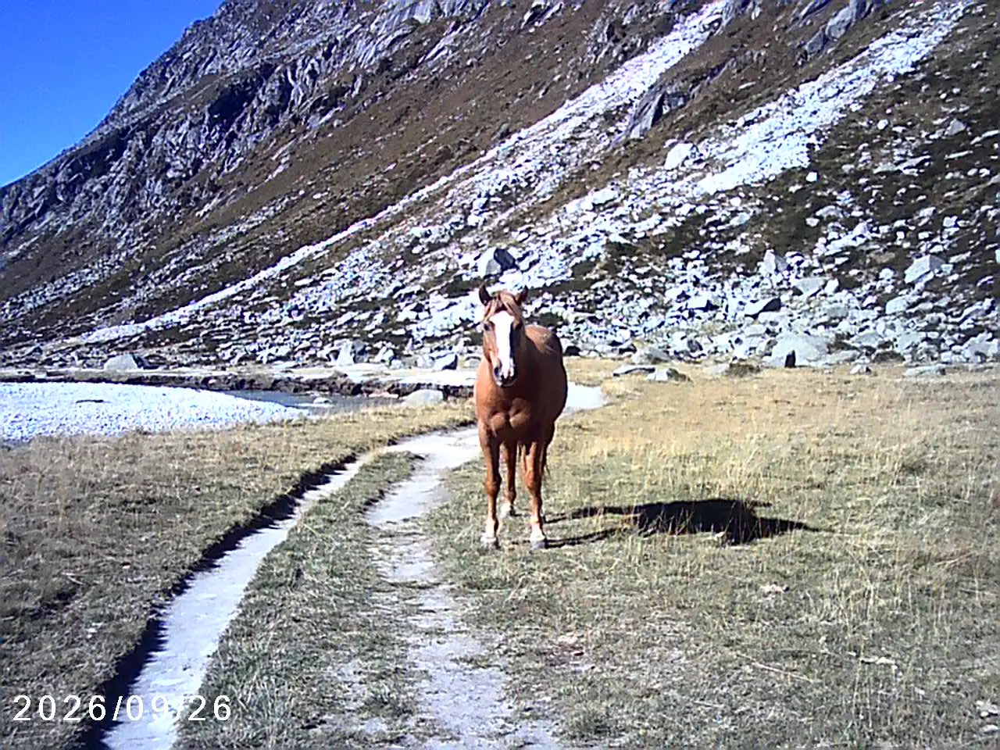
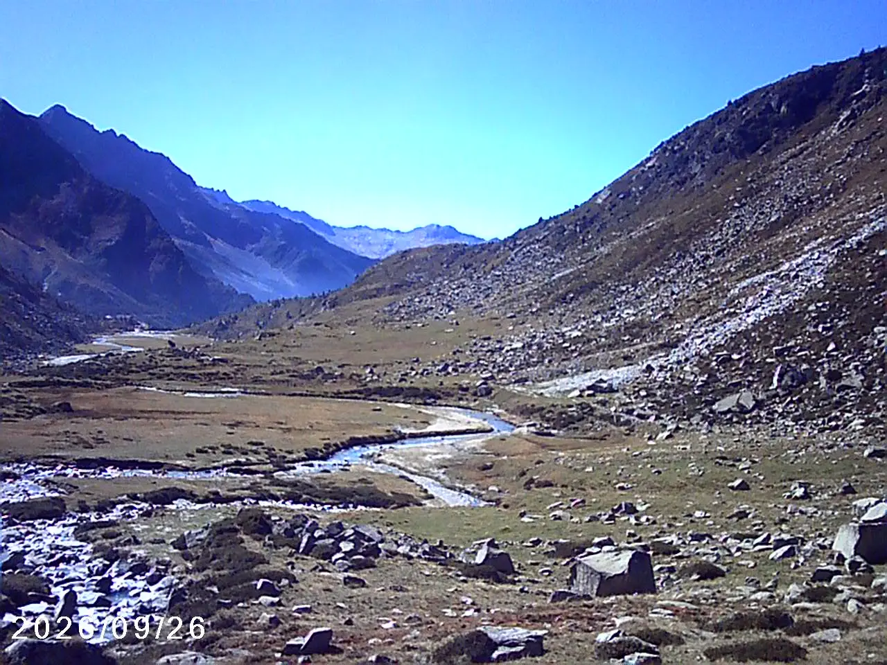
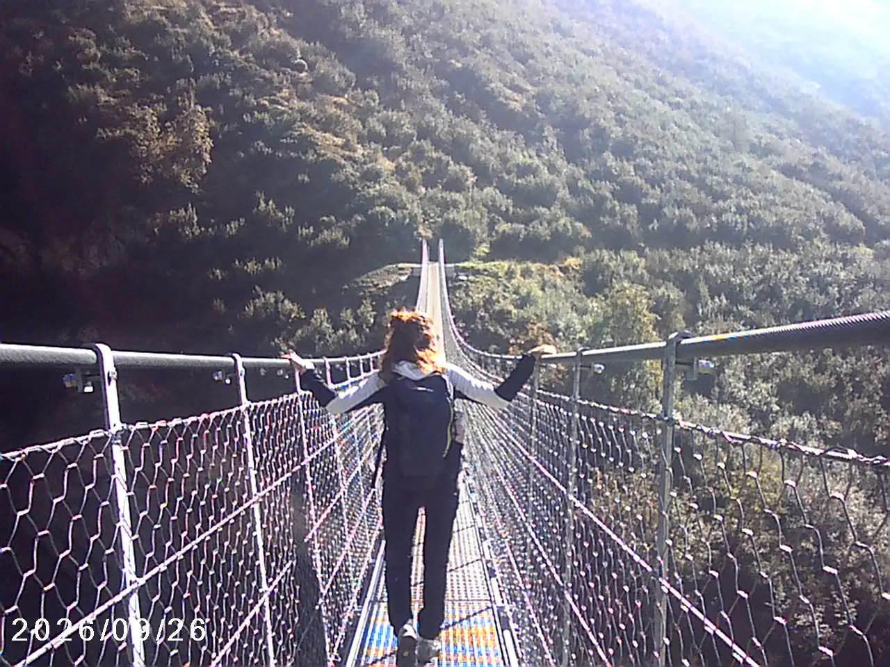
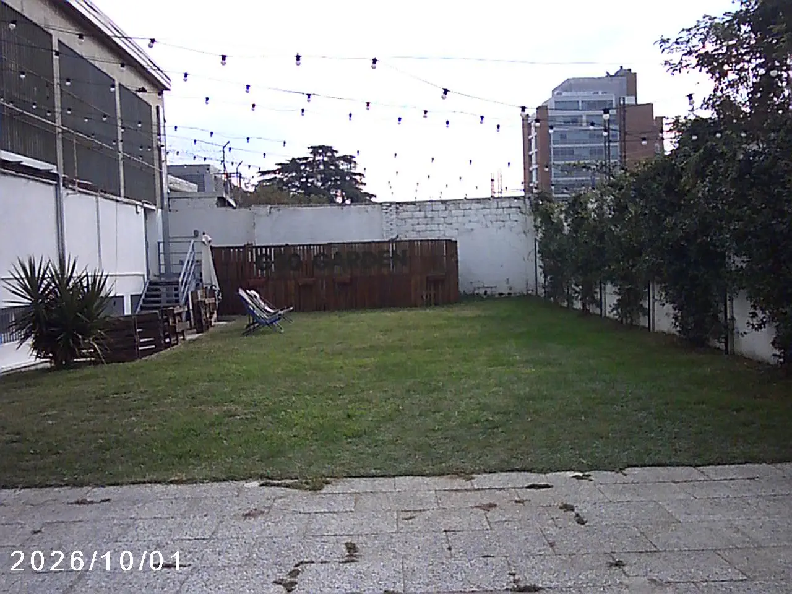
